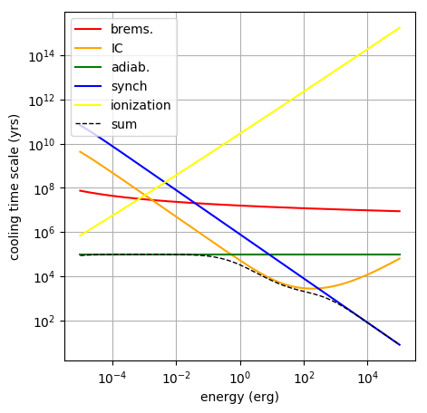

[(one page up)](tutorials_main.md)

How to View the Time-Scales of the Relevant Cooling Processes
=============================================================

Sometimes it is important to know the cooling time scale of electrons
due to different energy-loss mechanisms. 
This information is available through the `Particles`-class function
`GetCoolingTimeScale()`, here's how:


## Step 1: create and set up a Particles-object

```
import gappa as gp
fp = gp.Particles()
# set up particle spectrum with random environmental parameters
fp.AddThermalTargetPhotons(10,10*gp.eV_to_erg)
fp.SetAmbientDensity(1)
fp.SetRadius(1)
fp.SetExpansionVelocity(1e9)
fp.SetBField(5e-6)
fp.SetAge(1e5)
```

## Step 2: Use the GetCoolingTimeScale() function

```
# extract the cooling time scales at energy points 'e'
e = np.logspace(-5,5,150)
fp.GetCoolingTimeScale(e,"sum")
fp.GetCoolingTimeScale(e,"inverse_compton")
fp.GetCoolingTimeScale(e,"bremsstrahlung")
fp.GetCoolingTimeScale(e,"adiabatic_losses")
fp.GetCoolingTimeScale(e,"synchrotron")
fp.GetCoolingTimeScale(e,"ionization")
```

This will give you the cooling time scales at `t=age`. If you are interested
at the cooling time scales at different times, you can get that by specifying
at time `t` too, e.g.:

```
fp.GetCoolingTimeScale(e,"synchrotron",t)
```

This [script](loss_times.py) will create the following
plot:



By the way, if you are interested in the energy loss rate, `dE/dt [erg/s]` instead of the 
cooling time scale, you can call the `fp.GetEnergyLossRate()` function with exactly the same syntax as above.

