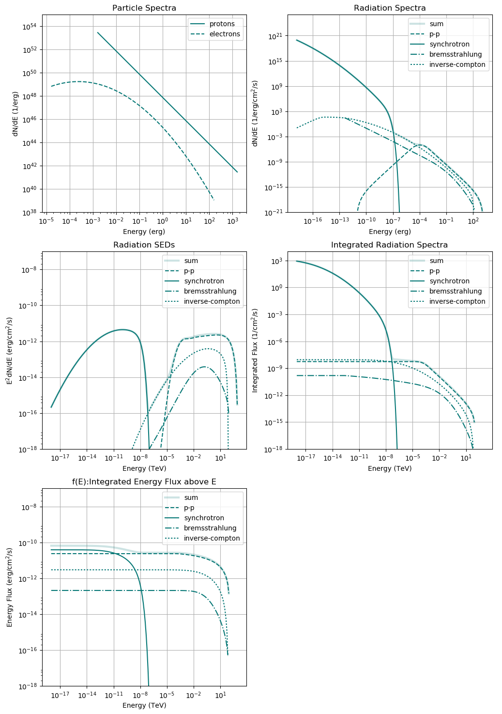

Step-by-step: broad-band radiation spectrum from a parent population of particles
=================================================================================

A complete working script can be found [here](RadiationBasics.py). 


Step 1: Define a particle spectrum
----------------------------------

The first step is to define a 2D vector (C++) or list / numpy array (python) 
defining a particle spectrum. This spectrum has to be differential in energy. 
How this spectrum is computed doesn't matter as long as it is in the right 
units and format. The spectrum has to be a vector or list of {energy, differential 
particle number} tuples. The energy has to be in erg, and the differential particle 
number has to be in particles / erg . 

For instance, a power-law can be defined in python using numpy as simply as
```
# define the energy range of the particles, here between 1 GeV and 1 PeV
energy_in_erg_particles = np.logspace(-3,3,200) * gp.TeV_to_erg

# make the power-law, norm has to be in the right format so that it reflects
# particles  /  energy in ergs
particles = norm * energy_in_erg_particles**-alpha

# zip together to a 2D-list
particles = np.array(zip(energy_in_erg_particles,particles))
```
The units of the spectrum will impact the unit of the calculated radiation spectra. 
For instance, if the unit of the particle spectrum only differential in energy, 
i.e. 1/erg, the output radiation spectra will have the unit of a flux if a 
source distance is specified (see below) or differential photon count per energy and time if not. 

On the other hand, if the input unit is differential also in volume, i.e. 1/erg/cm^3, 
then also the output radiation spectrum will be. Therefore, if no distance is 
specified in this case, a volume photon emissivity will be calculated, i.e. d³N/dEdVdt. 

The `Particle` class in `GAMERA` creates spectra already in the right format and 
is the natural 'counterpart' to the Radiation class. It allows, among other things, 
for time-dependent modeling. Tutorials how to use it are available, too.


Step 2: create a Radiation object and set it up
-----------------------------------------------

Creating a Radiation object works like
```
fr = gp.Radiation()
```

Define relevant parameters
```
b_field = 1e-5 # in Gauss, necessary for Synchrotron calculation

ambient_density = 1 # 1/cm^3, necessary for Bremsstrahlung and hadronic emission

# radiation field parameters, necessary for Inverse-Compton radiation. 
temp = 2.7 # Temperature in K
edens = 0.25 * gp.eV_to_erg # energy density in erg / cm^-3

distance = 1e3 # in pc

```

and set up the Radiation object with these parameters

```
fr.SetAmbientDensity(ambient_density)
fr.SetBField(b_field)
fr.AddThermalTargetPhotons(t_cmb,edens_cmb)
fr.SetDistance(distance)
```

Now set up the particle spectrum. You can decide what kind of particles 
you put there. This will determine which radiation processes will be calculated.

```
fr.SetProtons(particles) 
fr.SetElectrons(particles) 
```

Step 3: Calculate the radiation spectra and retrieve them
---------------------------------------------------------

The differential spectrum is calculated at a specified set of points in energy 
space. The unit of these points in energy is again erg. This set of points is 
defined by a 1D-vector (`C++`) or list / numpy array (`python`), for example:
```
e = np.logspace(-6,15,bins) * gp.eV_to_erg #[a]
```
Then, the radiation spectrum is calculated at these energies via 
```
fr.CalculateDifferentialPhotonSpectrum(e)
```

The now calculated spectra can be accessed in form of either
- differential photon spectra (`dN/dE`, units: `1 / erg / cm^2 / s`)
```
fr.GetTotalSpectrum()  # sum of all components
fr.GetPPSpectrum() # inelastic proton scattering
fr.GetSynchrotronSpectrum()# synchrotron radiation
fr.GetBremsstrahlungSpectrum() # bremsstrahlung
fr.GetICSpectrum() # inverse-compton scattering
```
   
- SEDs (`E^2*dN/dE`, units: `erg / cm^2 / s`) 
```
fr.Get*SED() # * denotes the radiation mechanisms above!
```
- integrated flux (`int_e^inf dE dN/dE`, units: `1 / cm^2 / s`)
```
fr.GetIntegral*Flux(emin,emax) # emin, emax in TeV!
```
- integrated energy flux (`int_e^inf dE E*dN/dE`, units: `erg / cm^2 / s`)
```
fr.GetIntegral*Flux(emin,emax) # emin, emax in TeV!
```
fr.GetIntegral*EnergyFlux(emin,emax) # emin, emax in TeV!
```


The so-retrieved spectra are in the format of 2D-vectors (C++) or 2D-lists (python). 
 
> Notes:
> Specifying a distance value is optional. If set to non-zero value, photon flux from particle population at that distance will be calculated. Otherwise, the luminosity is calculated. 

>For integral fluxes to be precise, you should make sure that your spectrum's 
binning is fine enough (you can change that by adjusting `bins` in the above step `[a]`). 
You can get an idea of the required binning [here](binning.md). 

>You only have to set the parameters relevant to the radiation process you want to calculate. For example, if you are only interested in Bremsstrahlung, you don't have to specify the B-Field

>For the IC process there are several ways to set up the radiation fields, including for SSC modelling or anisotropy, [see here](inverse_compton.md)


 

