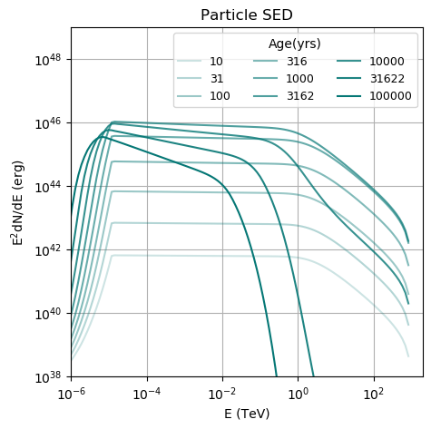

# Time-Dependent Modeling

Time-dependent modeling, i.e. modeling the spectral evolution of sources while 
physical parameters like magnetic fields are changing over time, can be done 
in `GAMERA` in much the same way as static modeling described [in a separate tutorial](time_independent_modeling.md).

## Time-Dependent Environmental Observables And Energy Losses
If you want to model time-dependent observables such as the ambient magnetic field 
and therefore also time-dependent energy losse, the only difference is instead 
of giving skalars to the `Setter`-functions you have to provide 2D-vectors. 
These vectors need to constist of two columns, with the first column holding the 
time steps and the second the value of the environmental parameter at that time. 
For instance, if you wanted to define a magnetic field declining with time as 
 

 
you would have to implement this like that:

```
fp = Particles()
t_ref = 100
time_steps = np.logspace(1,4,100) #in years
b = 1e-4 * (time_steps / t_ref) ** -0.5 #in Gauss
b_lookup = zip(time_steps,b)
fp.SetBField(b_lookup)
```

This simple implementation works with
- ambient density 
- source injection luminosity 
- expansion velocity and radius

For more complicated parameters, the method of applying time-dependency
is different:
- Very similar to the steps above is the treatment for energy-independent but time-dependent particle escape time:
```
t_esc_0 = 1000 * gp.yr_to_sec
t_esc = t_esc_0 * (time_steps / t_ref) ** 0.5
t_esc_lookup = zip(time_steps)
fp.SetTimeDependentEscapeTime(t_esc_lookup)
```
If the escape time depends also on energy, also the spectral shape can be made
to change with time, see [here](particle_escape.md).

- CurrentlyTime-dependent radiation fields are only possible via an iterative
approach. There is an [extra tutorial on iterating](iteration.md).

- Apart from the injection luminosity `GAMERA` can also handle time-dependent spectral shapes of the injection spectrum, see [this tutorial](tt.md) 

- Currently time-changing radiation fields are only possible via an iterative
approach. There is an [extra tutorial on iterating](iteration.md).

A working script can be found [here](particles_time_dep.py), which will output the following plots: 

Temporal evolution of the particle spectrum assuming the following time dependences 
(escape time not set in this example): 
 



