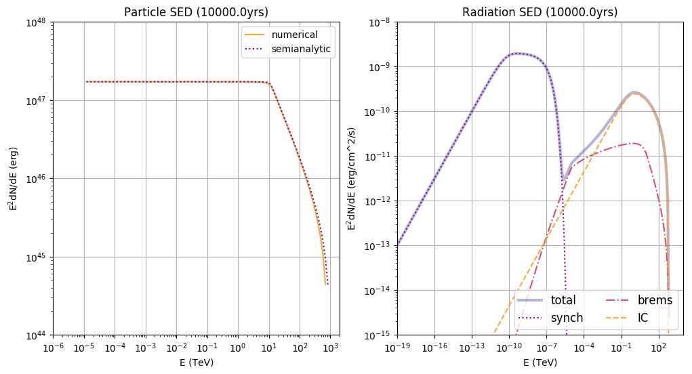
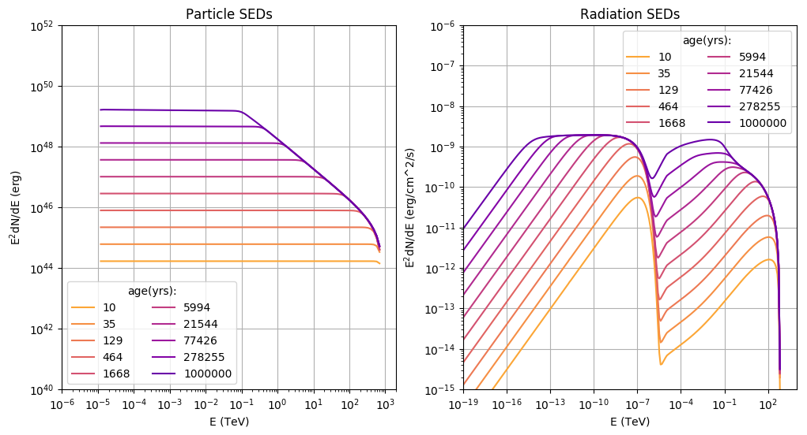

[(one page up)](tutorials_main_page.md)

Step-by-step: Time independent modeling of Particle Spectra
===========================================================


This tutorial will cover the scenario where a injected population of electron evolves in a static 
system. By that it is meant that magnetic field and other environmental parameters 
as well as the injection spectrum don't change over time. 

## Step 1: create a Particles-object

```
import gappa as gp
fp = gp.Particles()
```

## Step 2: Set up the injection spectrum

Here we will set a power law injection spectrum
```
# powerlaw with spectral index = 2, norm = 1e37 erg/s, 
# e_ref = 1TeV, range between 10MeV and 1PeV
e = np.logspace(-5,3,bins) * gp.TeV_to_erg 
power_law = (e/gp.TeV_to_erg)**-2

# renormalise to 1e37 erg/s
fu = gp.Utils()
power_law *= 1e37/fu.Integrate(zip(e,e*power_law))

# zip and set it up in the Particles-object
fp.SetCustomInjectionSpectrum(zip(e,power_law))
```

## Step 3: Set up environmental parameters

environmental parameters like B-Field and ambient density are set via `Setter`-functions: 
```
fp.SetBField(b_field) # in Gauss
fp.SetAmbientDensity(density) # in particles/cm^3
fp.AddThermalTargetPhotons(temperature,energy_density) #in K, erg/cm^3. 
```
>Note 1: 
>There is a [dedicated tutorial](inverse_compton.md) on how to set radiation fields for the IC process.
 
>Note 2:
>Environmental parameters determine the cooling rate of electrons. Check [this tutorial](energy_losses.md) on how to visualise this information.


## Step 4: Set the source age

the specified system will be evolved to the point in time t = age. You can set
the age via

```
fp.SetAge(age) # in yrs
```

## Step 5: Compute the time evolution

Finally, the spectrum can be calculated:

### Electrons:
```
fp.CalculateElectronSpectrum()
```

### Protons:
```
fp.CalculateProtonSpectrum()
```

## Step 6: Get the particle spectra

You can access the result via two options:
```
sp  = fp.GetParticleSpectrum() # returns diff. spectrum: E(erg) vs dN/dE (1/erg)
sed = fp.GetParticleSED()  # returns SED: E(TeV) vs E**2*dN/dE (erg)
```

## Results

Here are two working scripts incorporating the above steps:
- [spectrum at a given time](particles_static.py)
  producing this plot:
  
  _see the optional steps below to learn more about the semi-analytical solution_
- [time series](particles_static_timeseries.py) 
  producing this plot:
  

## Optional Steps
### Set up a particle escape term
there are several options for this. Either a constant, an energy-dependent, a 
time-dependent or a both energy- and time-dependent escape time can be applied.
[Here](particle_escape.md) you can learn how to do this. The easies case, a constant
escape time, is set up like this:

```
fp.SetConstantEscapeTime(t_esc) # in seconds
```

### Set starting point of iteration
The program needs to know at which point in time to start the iteration.
It will then set the initial condition of the system accordingly. 
Per default, a starting time of tmin = 1yr will be assumed, which is OK for
sources that evolve on time scales larger than tens of years. 
If you are interested in modeling sources that develop at a smaller time scale,
you have to set tmin appropriately:

```
fp.SetTmin(tmin) # yrs
```

>Note: 
>The initial condition is assumed to be the result of loss-free injection of particles until t = tmin. The spectral shape of the injection up until this point is fixed to the value at t = tmin, i.e. Q(t<=tmin) =  Q(t=tmin). Only at t>tmin will cooling, escape and the actual evolution of Q be taken
into account.

### Set solver method
If you are sure that the energy losses are constant in time and you haven't set 
particle escape, you can also use a semi-analytical solver to the transport 
equation (for more infos, see [here](documentation.md) with the following command:

```
fp.SetSolverMethod(1)
```

_Please note that this will give you __wrong__ results if you have time-dependent
losses, like changing B-fields, adiabatic losses etc.!_

This method is less flexible but more precise in those cases where it is applicable.

[(one page up)](tutorials_main_page.md)


