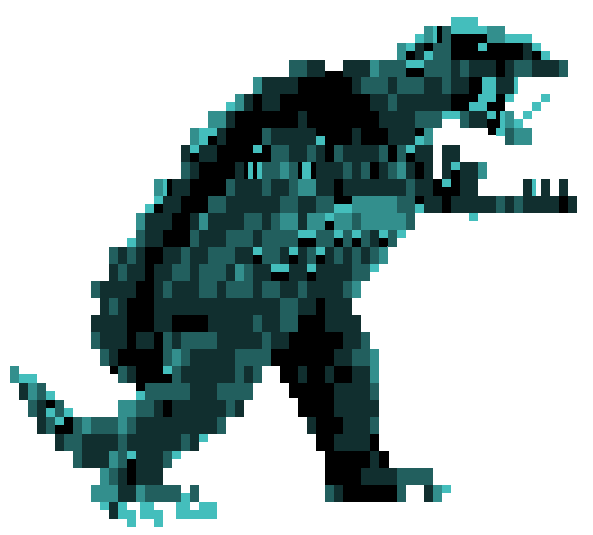

Tutorials
=========


How to ...

- [calculate the broad-band radiation spectrum from a parent population of hadrons or electrons](radiation_modeling.md)
- [evolve a particle population in a time-constant environment](static_modeling.md)
- [evolve a particle population in a changing environment](dynamic_modeling.md)
- [take particle escape into account](particle_escape.md)
- [access your energy loss scales](energy_loss.md)


Please note:
------------
 
At the time of writing, `python` is quite popular and the tutorials are provided in that 
language. However, you can use `GAMERA` also in your `C++` program by adapting 
the syntax, e.g. instead of the `python` code
```
fr = gappa.Radiation()
fr.SetBField(b)
[...]
sed = fr.GetTotalSED()
```
you could write in `C++` syntax
```
Radiation *fRad = new Radiation();
fRad->SetBField(b);
[...]
vector< vector<double> > SED = fRad->GetTotalSED();
```
Please check out the [installation instructions](download_installation.md) to learn how to make `GAMERA` work
in either language.

 
